### 如何使用fd快速抓包插件抓到我们需要的封包
##### 电脑端(只需设置一次)
1. 安装Fiddler Classic(此步略过)
2. 找到Fiddler的安装位置，进入Script文件夹

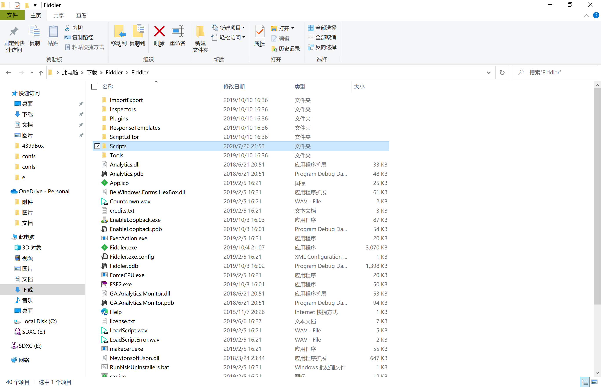

3. 将插件([fd快速抓包插件.dll](https://gitee.com/in_dream_m/box4399_assistant/blob/master/抓包教程/fd快速抓包插件.dll),**不能使用的话自行改名为4399_JS.dll**)复制到这个文件夹中

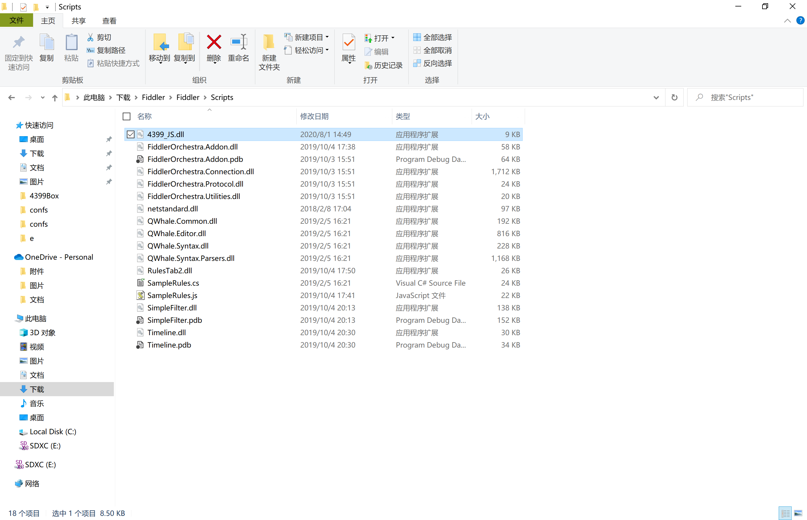

4. 打开Fiddler，发现右边标签栏中出现插件名称

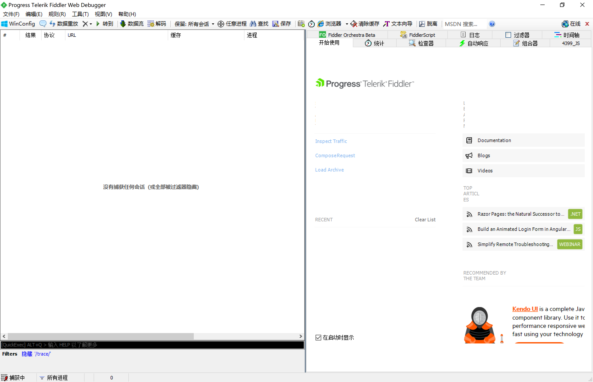

5. 记录下Fiddler主机的ip地址，将鼠标移到右上角的标志上即可查看

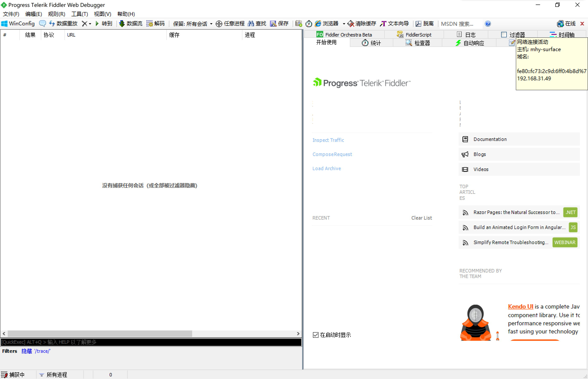

6. 此时软件还不能抓到HTTPS的加密包，接下来进行下一步操作
在菜单栏中选择工具→选项

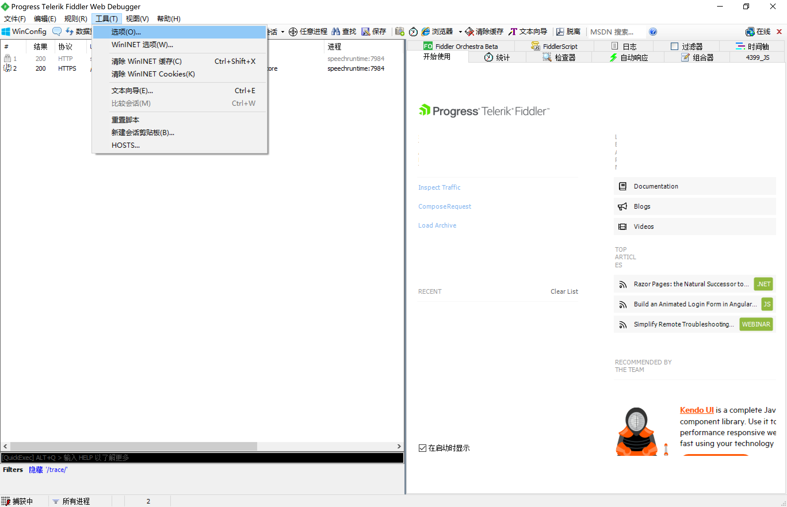

7. 在标签页中选择HTTPS，勾选以下内容：

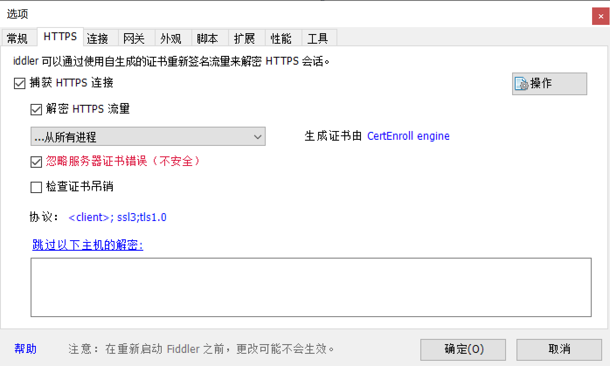

8. 点击操作按钮，选择信任根证书

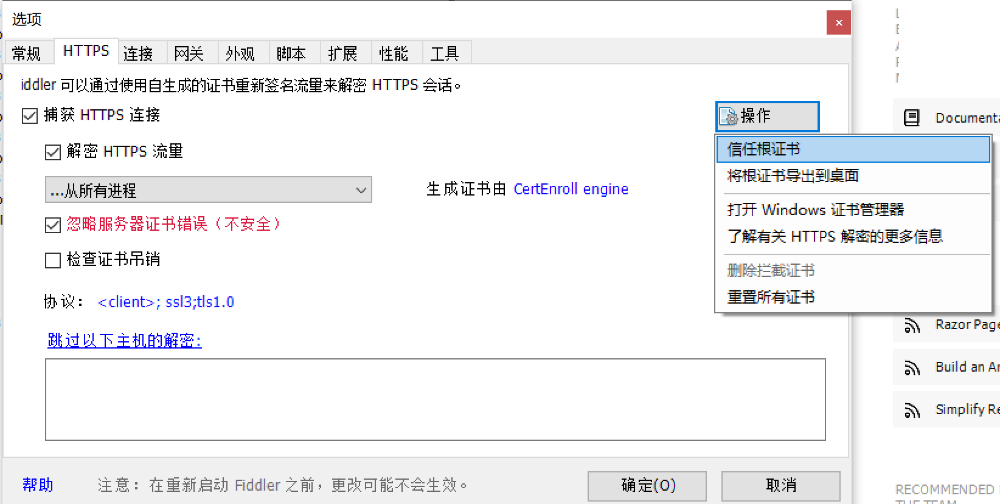

9. 接下来会弹出两个对话框，均选择是/YES

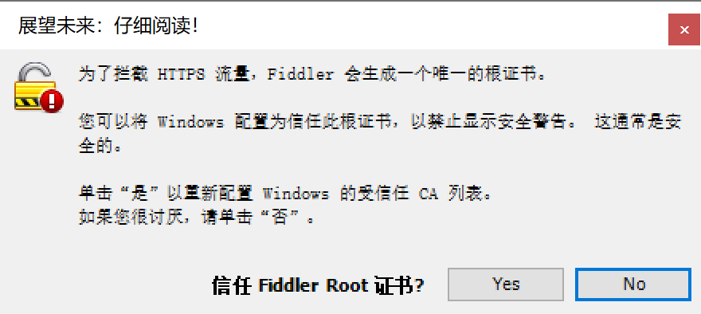
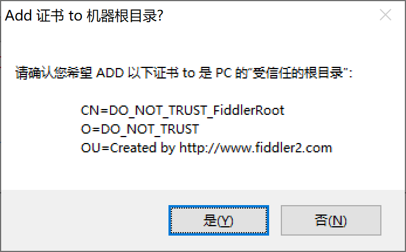

10. 接下来选择标签【连接】，进行如下勾选

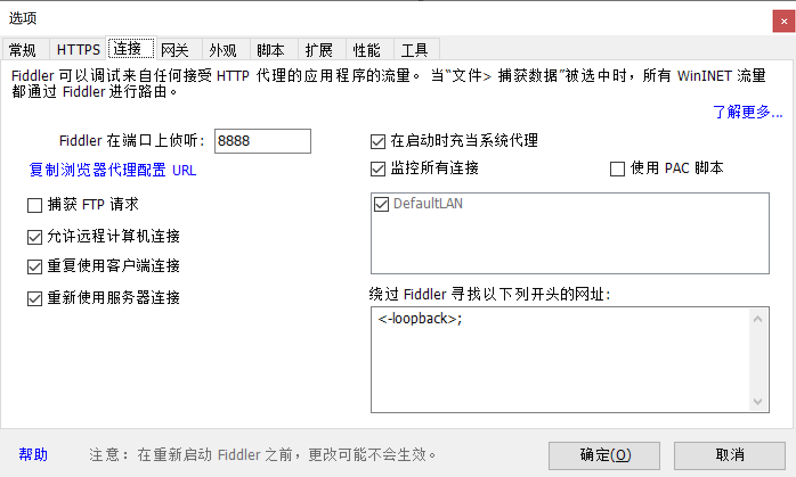

11. 点击确认保存设置，重启Fiddler。

至此，电脑端的设置结束
##### 手机端(不同手机设置可能有所区别)
12. 接下来设置手机端，打开手机/模拟器的WiFi设置页面

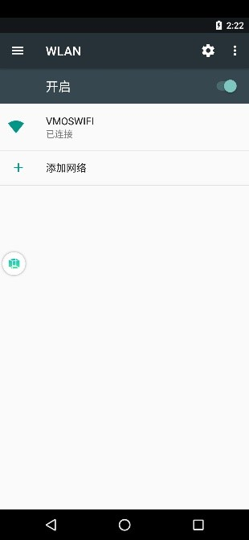

13. 长按当前使用的WiFi，选择修改网络

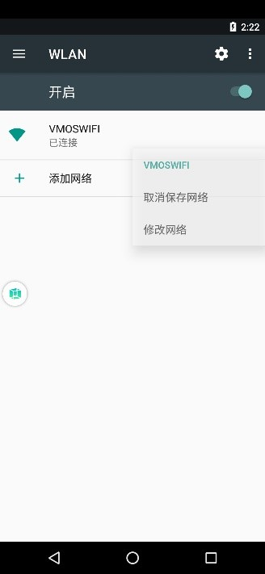

14. 选择代理为手动，将刚才记录的Fiddler所在的主机的ip地填进去，端口在刚才的步骤中可以修改，默认为8888，保存
**注意！进行此操作之后，所有的流量都会通过Fiddler软件，Fiddler软件必须处于开启状态，手机才可以联网。抓包结束之后请及时将代理修改为"无"**

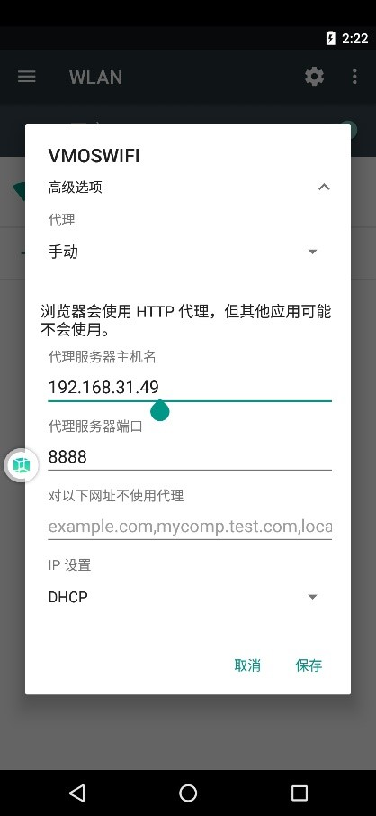

15. 此时，手机(模拟器)上所有软件的流量都将经过电脑的Fiddler。
回到Fiddler，进入刚才安装的插件页，点击开始捕获

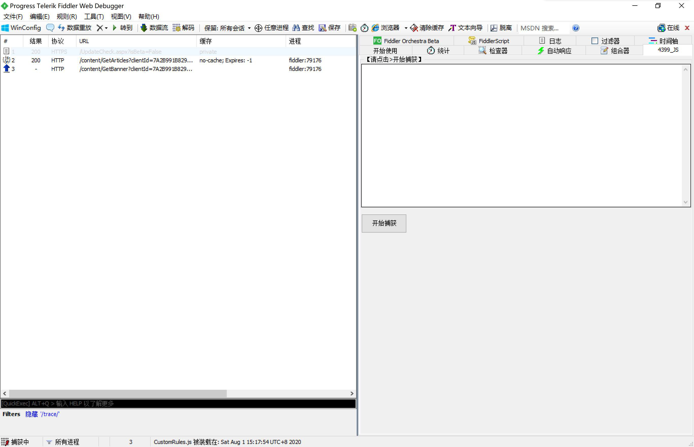

16.	之后在手机/模拟器端进入加速卡页面

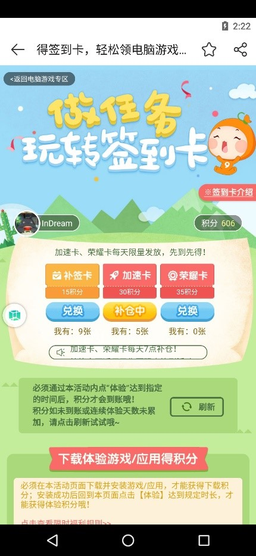

17. 电脑端将自动筛选出指定封包内容，按照指示进行操作即可

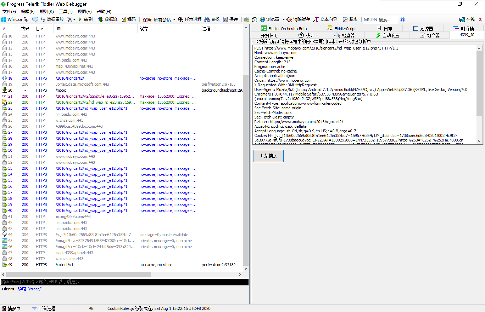

### 注意事项
1. **【非常重要】抢加速卡必须进行微信绑定，请提前根据指示完成绑定**
2. 每天需要输入一次验证码，请点击>准备>加速卡验证完成这一步，不填写的话无法自动抢加速卡
3. 建议游戏自动签到与自动抢加速卡功能同时使用，否则会遇到加速卡到上限，无法再获得的情况
4. 模拟器可能会出现无法获取积分的情况，请尝试修改封包中的User-Agent，如果软件仍无法使用，请切换实机安装游戏盒。
5. 自动抢奖品仅为测试功能，不保证能抢到奖品，敬请期待之后【可能并不存在】的JS版本
6. 软件/插件仅供交流学习使用，侵权必删

