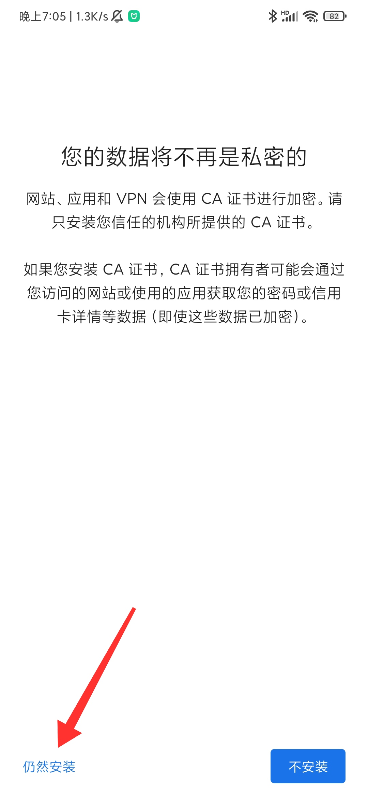

###如何在安卓端使用HttpCanary抓到登录信息
###苹果端请自行搜索抓包软件 步骤基本相同
##### 首次使用（安装证书及设置） 
1. 安卓手机下载HttpCanary（[点击下载](./HttpCanary.apk)，并安装）
2. 打开HttpCanary，点击屏幕中灰色区域的任意位置，进入主页面。

3. 从侧边栏中打开设置页

4. 在设置页中选择SSL证书设置(因为需要抓取https包)

5. 选择安装SSL证书

6. 【如果能够正常安装】请按照提示自行安装证书，然后跳转到[第14步](#14)
【如果出现以下提示】请继续按照本教程执行(新版安卓加强了权限管控)

7. 选择导出SSL根证书

8. 选择第二项，导出.pem格式的证书

9. 在手机设置中搜索"证书"关键字

10. 选择CA证书,在提示界面选择仍然安装

11. 之后依次进入 /内部存储/HttpCanary/cert 目录

12. 点击.pem文件进行安装

13. 随后采用相同方式将证书安装至"V*N和应用用户证书"

14. 回到设置页，选择要抓包的目标应用

15. 选择右上角的加号

16. 搜索"4399"并选中

17. 至此，证书安装及设置过程完成

##### 正式抓取登录过程

18. 在HttpCanary首页点击右下角纸飞机，开始

19. 这里可以进入加速卡页面的前一页面（签到页面）

20. 加载完毕后清空抓包列表

21. 随后进入积分及加速卡页面

22. 等待加速卡页面加载出积分后停止抓包

23. 停止抓包（红色箭头）之后点击小框中间的放大符号（蓝色箭头）回到HttpCanary页面

24. 选择右上角放大镜对封包进行筛选

25. 选择HTTP方法

26. 仅选中POST方法

27. 回到主页，选择具有红框特征的封包(域名为绿色划线部分)，任意选择一个进入即可

###【更正】目前域名更新为huodong2.4399.com,即绿色划线部分要等于该域名。

###【更正】目前域名更新为huodong2.4399.com,即绿色划线部分要等于该域名。

28. 进入后选择请求页（红色箭头）

29. 选择raw选项卡(红色箭头)

30. 全选并复制

31. 发送给我

